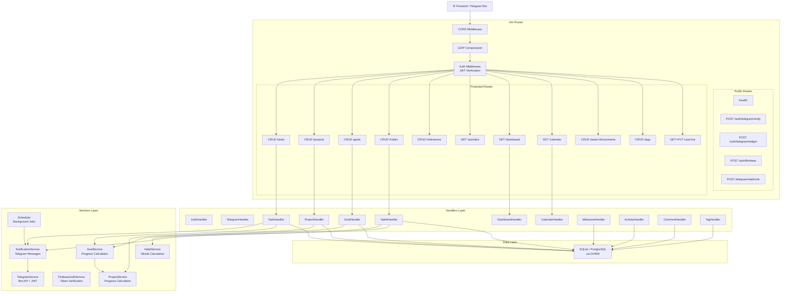
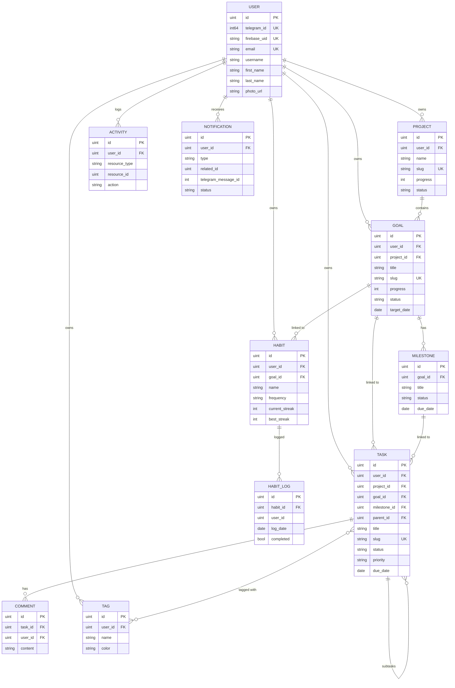
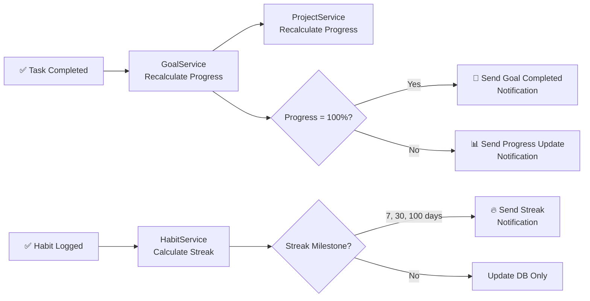
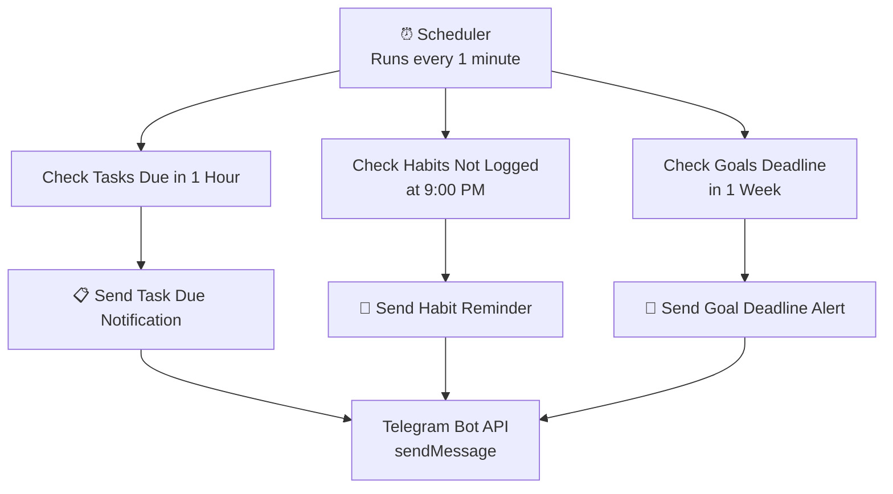

# Backend Architecture Flow

## 1. Request Lifecycle

How every HTTP request flows through the backend:

## 2. Database Schema Relationships

## 3. Auto-Progress Chain

When a Task is completed, a chain reaction updates everything:

## 4. Scheduler Background Jobs

